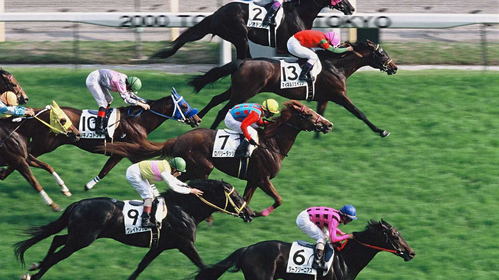

  

# Ichiban Runner – Who Is Number One Horse

## Introduction

In this project, we aim to build a classification model to predict horse racing outcomes using historical data from the Japan Jockey Association (JRA). Our primary goal is to determine whether a horse will finish in the top 1 position of a race and to evaluate different machine learning algorithms for predictive performance and interpretability.

## Problem Statement

We formulate this as a multiclass classification problem:

    Top 1: Horse wins the race

The broader goals include:

    Identifying the most predictive features of race outcomes.

    Evaluating and comparing multiple machine learning models.

    Recommending the best model based on a balance of accuracy and interpretability.

## Data Overview

    Source: Japan Jockey Association (JRA)

    Collection: Web-scraped historical data

    Granularity: Each row = one horse’s result in one race

## Features
* Since each model learns features differently, these models we try are input different features based on their feature importances.

## Feature Engineering

-Transformed Final Time from mm:ss.s to total seconds.

- Parsed Age/Sex into two features: numeric age and categorical sex.

- One-hot encoded Grade, Weather, and Race Type.

- Created binary target variables for Top 1 and Top 3 finishes.

- Normalized Odds and Horse Weight.

## Reproduction

## Modeling & Evaluation

We tested the following models:

    Logistic Regression (baseline)

    Decision Tree

    K-Nearest Neighbors

    Random Forest

    LightGBM

    Neural Network (PyTorch)

    RBF SVC
### LightGBMClassifier Model: 
* LightGBM (Light Gradient Boosting Machine) is a tree-based model which is usually used for classification when working with large dataset. Based on our goal, this LightGBM Classifier is combined with parwise since it is a ranking problem to let horses compete 

## Metrics

Models were evaluated using:

    Accuracy

    ROC-AUC Score

    Average Precision

    Confusion Matrix

## Results

## Limitations

## Conclusion/Recommendation

## Appendix
