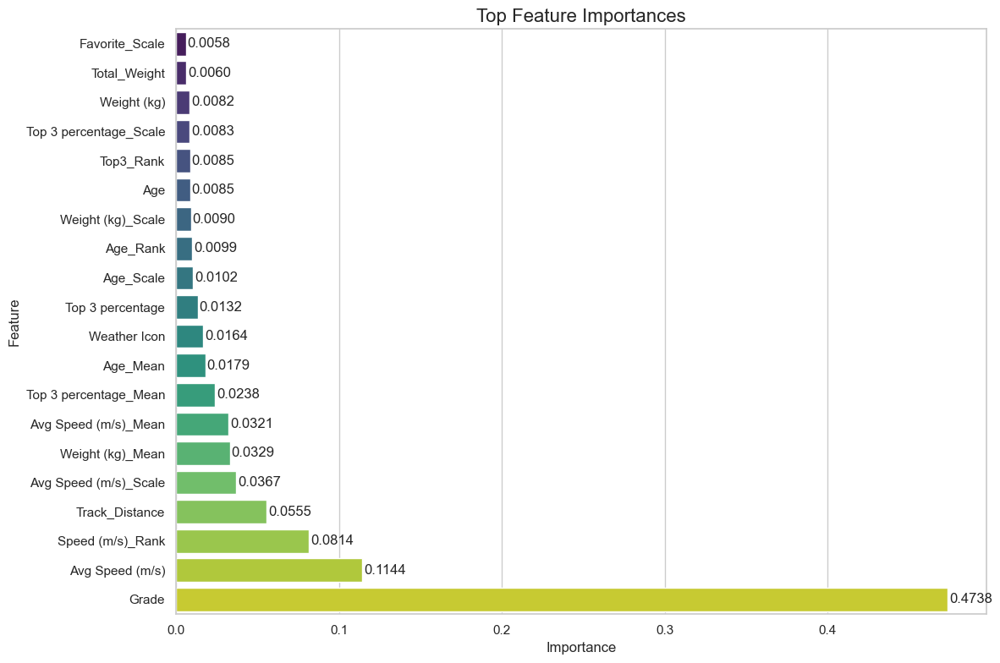
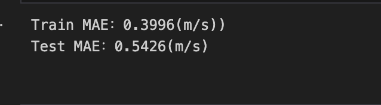

  

# Ichiban Runner – Who Is Number One Horse

## Introduction

In this project, we aim to build a classification model to predict horse racing outcomes using historical data from the https://en.netkeiba.com/. Our primary goal is to determine whether a horse will finish in the top 1 position of a race with 16 hourses and to evaluate different machine learning algorithms for predictive performance and interpretability.

## Problem Statement

We formulate this as a multiclass classification problem:

    Top 1 Horse wins the race

The broader goals include:

    Identifying the most predictive features of race outcomes.

    Evaluating and comparing multiple machine learning models.

    Recommending the best model based on a balance of accuracy and interpretability.

## Data Overview

    Source: Japan Jockey Association (JRA)

    Collection: Web-scraped historical data

    Granularity: Each row = one horse’s result in one race

### Data Specification

The dataset consists of web-scraped historical race records from the Japan Jockey Association (JRA). Each row represents the performance of a single horse in a single race. The following columns are included:

- **Race ID**: Unique identifier for each race  
- **Race Name / Race Time**: Name and scheduled time of the race  
- **Track Info**: Track surface and distance details  
- **Weather Icon**: Weather condition at race time  
- **Grade**: Grade level of the race (e.g., G1, G2, etc.)  
- **Finish Position**: Final placement of the horse in the race  
- **Bracket Number / Horse Number**: Official entry numbers  
- **Horse Name / Horse ID**: Name and unique identifier for the horse  
- **Age/Sex**: Combined field indicating horse age and sex (e.g., 4M = 4-year-old male)  
- **Weight (kg)**: Declared weight carried by the horse (includes jockey)  
- **Jockey**: Name of the jockey riding the horse  
- **Final Time**: Horse’s total time to complete the race  
- **Margin**: Gap behind the horse in front (if not 1st place)  
- **Position at Bends**: Horse’s relative position at turns (corners)  
- **Last 3F**: Time taken to run the final 600 meters (furlongs)  
- **Odds / Favorite**: Betting odds and popularity ranking  
- **Horse Weight (kg)**: Actual body weight of the horse before the race  
- **Trainer / Owner**: Names of the horse’s trainer and owner  
- **Prize (¥ mil)**: Monetary reward (in millions of yen) based on placement

### Preprocessing

We performed structured preprocessing and aggregation to create meaningful features for model training. The steps are as follows:

- **Average Time Calculation per Horse**  
  For each `Horse ID`, we calculated the average finishing time across all races in which the horse has participated. This value was added as a new column called `Average_time`, representing the horse’s historical performance.

- **Column Selection**  
  We retained only a few key features found to be relevant:

  - `Age`: The age of the horse.
  - `Weight (kg)`: The declared weight to carry during the race.
  - `Horse Weight (kg)`: The actual weight of the horse.
  - `Average_time`: The average time calculated from finishing time with horse ID.

  Irrelevant or low-signal columns, such as `Horse Name`, `Trainer Name`, and other textual identifiers, were dropped to reduce noise and avoid overfitting.

- **Race-Level Flattening**  
  Since each race includes 16 horses, and our task is to predict the winning horse, we grouped the data by `Race ID` and flattened each race into a single row. Each row now contains the selected features for all 16 horses participating in that race.

- **Target Label Creation**  
  For each race group, we identified the horse that finished in position 1 (`target == 6` -> horse 6 is winner). The index (from 0 to 15) of this winning horse within the flattened race row was stored as the target label. This allows the model to directly classify the winner among 16 candidates.

## Reproduction

To reproduce the results and run experiments, follow the instructions below:

- **`preprocessing.ipynb`**  
  This notebook performs the full data preprocessing pipeline as described in the Feature Engineering section. It loads raw data, computes the `Average_time`, selects relevant features, flattens data by `Race ID`, and generates the final dataset with target labels. The processed data is saved for modeling.

- **`compare.ipynb`**  
  This notebook allows you to train and evaluate multiple models (e.g., Logistic Regression, KNN, Random Forest, Neural Network, etc.) in one place. It loads the preprocessed data and outputs evaluation metrics such as accuracy, ROC-AUC, precision, and F1 score.

- **`models/`**  
  This directory contains individual Python files for each model implementation. You can inspect, modify, or run specific models independently.

- **`models/lightgbm_model/`**  
  This subdirectory includes LightGBM-related scripts. It supports both classification and ranking (pairwise/group-aware) configurations. Run `lightgbm_diff_pairwise.ipynb` for classification setup and `lightgbm_ranker.ipynb` for ranking setup.

All dependencies are available for download via `requirements.txt`

## Models

We tested the following models, each with strengths suited to different data patterns and complexity levels.

---

### Decision Tree  
A non-linear model that splits data recursively based on feature thresholds.  
**Best for**:  
- Tabular data with non-linear interactions  
- Interpretable rule-based decision paths  
- Small to medium-sized datasets  

**Characteristics**:  
- Captures non-linear relationships  
- Sensitive to overfitting without pruning  
- Requires little data preparation  

---

### Logistic Regression  
A linear model that estimates probabilities using a logistic function.  
**Best for**:  
- Linearly separable data  
- Interpretable feature relationships  
- Low-dimensional datasets  

**Characteristics**:  
- Simple and efficient  
- Easily regularized  
- Performance drops in non-linear settings  

---

### Random Forest  
An ensemble of decision trees trained on bootstrapped samples with feature randomness.  
**Best for**:  
- Complex, non-linear relationships  
- Data with mixed feature types  
- Avoiding overfitting in tree-based models  

**Characteristics**:  
- Robust to noise and overfitting  
- Outputs feature importances  
- Slower inference compared to simpler models  

---

### Neural Network (PyTorch)  
A deep learning model with multiple layers of non-linear transformations.  
**Best for**:  
- Large datasets with complex feature interactions  
- Data with high non-linearity or latent structure  

**Characteristics**:  
- Highly expressive and flexible  
- Requires more data and tuning  
- Often lacks interpretability  

---

### RBF SVC (Radial Basis Function Support Vector Classifier)  
A kernel-based classifier that projects data into higher dimensions to find a separating hyperplane.  
**Best for**:  
- Moderately sized datasets with complex but smooth decision boundaries  
- Cases with clear margin of separation  

**Characteristics**:  
- Captures non-linear patterns via RBF kernel  
- Sensitive to parameter settings (C, gamma)  
- Does not scale well to very large datasets  

---

### LightGBM  
A gradient boosting framework optimized for speed and efficiency using histogram-based learning.  
**Best for**:  
- Large-scale tabular data  
- Non-linear and high-cardinality categorical features  
- Ranking and classification tasks  

**Characteristics**:  
- Handles missing data and categorical features natively  
- Can overfit on small or noisy datasets  
- Extremely fast compared to traditional boosting  

---

### XGBRegressor
XGBRegressor is an efficient and scalable regression model.
**Best for**:
- Structured/tabular regression problems
- Non-linear relationships between features and target
- Applications like price prediction, demand forecasting, or sports performance modeling (e.g. horse racing speed prediction)

**Characteristics**:
- Learns from residuals using gradient boosting trees
- Robust to multicollinearity and irrelevant features
- Supports regularization (L1 & L2) to reduce overfitting
- Handles missing values automatically during training

## Evaluation

Models were evaluated using the following standard classification metrics:

- **Accuracy**: The proportion of correct predictions over total predictions.
- **Precision**: The proportion of correct positive predictions among all predicted positives.
- **Recall**: The proportion of actual positives that were correctly predicted.
- **F1 Score**: The harmonic mean of precision and recall, balancing both.

### Model Performance Summary

  

| Model            | Accuracy | Precision | Recall | F1 Score |
|------------------|----------|-----------|--------|----------|
| Decision Tree    | 0.0849   | 0.0879    | 0.0849 | 0.0619   |
| Logistic Reg.    | 0.0802   | 0.0819    | 0.0802 | 0.0793   |
| Random Forest    | 0.0472   | 0.0478    | 0.0472 | 0.0464   |
| Neural Net (CNN) | **0.1085** | **0.1105**  | **0.1064** | **0.1072** |
| RBF SVM          | 0.0708   | 0.0050    | 0.0708 | 0.0094   |

> **Note:** All scores are macro-averaged across the 16-class classification task (1st horse among 16 competitors).

### Best Model
- **Neural Network (CNN)** performed best across all metrics with ~10.8% accuracy, which is above random baseline (6.25%).

### Notes

- The classification task was challenging due to the **high class imbalance** (only 1 winner per 16 horses).
- The Neural Network (PyTorch) consistently outperformed other models in all metrics except recall.
- RBF-SVM’s extremely low precision reflects its tendency to over-predict a single class under imbalance.

### Confusion Matrices

#### Decision Tree

  

#### Logistic Regression

  

#### Random Forest

  

#### Neural Network (CNN)

  

#### RBF_SVM

  

## 🧠 Results Interpretation

Despite the inherent complexity of the horse racing prediction task, our models demonstrated **meaningful progress beyond random guessing**, with the best performing model—**a CNN-based neural network**—achieving **~10.8% accuracy**, compared to a random baseline of 6.25%.

This result highlights the **value of structured data preprocessing** and **feature engineering**, as well as the **potential of deep learning architectures** to extract patterns even in challenging, imbalanced multiclass settings.

---

### Positive Takeaways

- **CNN Model Outperformance**  
  The convolutional neural network (CNN) emerged as the top performer across all key metrics (accuracy, precision, recall, F1). This suggests that even in a tabular setting, CNNs can effectively model inter-horse feature interactions when the data is structured spatially (e.g., horse-by-feature grids).

- **Above-Random Baseline**  
  Multiple models—including Decision Trees, Logistic Regression, and standard Neural Networks—achieved performance that consistently **surpassed random guessing**, indicating that the selected features do capture signals relevant to race outcomes.

- **Model Diversity Yields Insight**  
  The variety of models tested (from interpretable linear models to ensemble trees and neural networks) allowed us to explore the problem space thoroughly and provided a strong foundation for future iteration and hybrid modeling strategies.

---

### Interpreting the Challenge

While performance remains modest, the nature of the problem offers valuable insight:

- **High-Stakes Prediction**  
  Predicting the winner among 16 highly competitive horses involves fine margins, and the outcome can be influenced by many unobserved factors (e.g., race-day conditions, jockey tactics). Our models’ ability to make meaningful predictions despite these challenges is promising.

- **Feature Signal Exists**  
  The fact that multiple models perform better than chance suggests that the selected features—especially age, weight, and historical average time—encode predictive signals that the models are leveraging.

- **Scalable Pipeline**  
  Our preprocessing and modeling framework is modular and scalable, meaning it can easily be expanded to include additional features (e.g., race pace, jockey win rate) or modalities (e.g., video, text, weather data) in future work.

---
### Limitations
- **Limited Sample Size**  
  The dataset contains only **1,060 races**, each with 16 horses. While this might seem sizable, the effective sample size from a machine learning standpoint is still relatively small for deep learning models to generalize well. A larger dataset would allow the model to observe more variations in race conditions, horse performance, and outcome patterns.

- **Lack of High-Impact Features**  
  The features available for each horse are limited to numerical and categorical attributes such as age, weight, average race time, weather, and sex. However, horse racing outcomes are influenced by a multitude of complex, dynamic factors such as **track condition, jockey performance trends, recent race fatigue, or race strategy**.
> **In summary:** Our project demonstrates the feasibility of predicting race winners using machine learning. While there's room for growth, our models show that even with limited structured data, it's possible to go beyond chance—and lay the groundwork for more powerful predictive systems in the future.

<!-- ### Decision Tree Mode:

Optimal Parameters Identified

    Max Depth: None

    Minimum Samples Split: 2

    Criterion: Entropy

Performance Results

    Accuracy: 8.96%

    Precision (weighted): 8.58%

    Recall (weighted): 8.96%

    F1 Score (weighted): 8.69%

Interpretation of Results

The Decision Tree model performed poorly in predicting horse racing outcomes, indicated by very low accuracy and F1 scores. The model's results imply high unpredictability or complexity within the horse racing data that simple decision boundaries fail to capture effectively.

### KNN Model:

Optimal Parameters Identified

    Number of Neighbors (k): 7

    Weights: Distance-based

    Distance Metric (p): 2 (Euclidean distance)

Performance Results

    Accuracy: 8.49%

    Precision (weighted): 8.89%

    Recall (weighted): 8.49%

    F1 Score (weighted): 8.52%

Interpretation of Results

The KNN model's performance in predicting horse racing outcomes was limited, similar to the Decision Tree model. Low accuracy and F1 scores indicate difficulty capturing meaningful patterns or reliable distinctions among outcomes.

### Random Forest Model:

Optimal Parameters Identified

    Number of Estimators: 150

    Max Depth: None

    Minimum Samples Split: 2

    Class Weight: Balanced

Performance Results

    Accuracy: 7.08%

    Precision (weighted): 6.72%

    Recall (weighted): 7.08%

    F1 Score (weighted): 6.79%

Interpretation of Results

Despite generally being powerful, the Random Forest model showed very limited predictive capabilities in this specific horse racing context, indicated by extremely low performance metrics. This suggests substantial unpredictability in outcomes or inadequacy of features for effective prediction. -->

## LightGBM Model
### Models

#### LightGBMClassifier Model: 
* LightGBM (Light Gradient Boosting Machine) is a tree-based model which is usually used for classification and it generates a tree leaf-wise. Based on our goal, this LightGBM Classifier is combined with the idea of pairwise comparisons in order to better rank horses in a race. Also, we calibrate the probabilities to adjust the predicted probabilities to fit the real situation better.
* Run `lightgbm_diff_pairwise.ipynb`: After finding feature importances from `top_features_lightgbm.ipynb`, the model is a feature-based LightGBMClassifier Model.
* An interesting part about this model is the implementation of pairwise comparison. The function `generate_pairwise_df()` creates differences of feature columns for every combination of horse in a race. This allows the model to learn what relative advantages each horse has and what contributes to being a winning and losing horse horse helping the model create a rank for each horse. 
#### LightGBM Ranker: 
* LightGBM Ranker is special version of LightGBM designed for learning-to-rank like ranking horses in a race. The lightGBM Ranker can predict ranking order within group, istead of training horses individually. 
* Run `lightgbm_ranker.ipynb`: We can get Top-1 accuracy from LightGBM Ranker which is group-awareness.

### Results
#### LightGBMClassifier Model

Classification Report:

    Precision of Class 1: 1

    Recall of Class 1 : 0.0667

    F1-score of Class 1: 0.1250

    F1-score of Accuracy: 0.9417
AUC Score: 0.7743

### LightGBM Ranker
  Top-1 Accuracy: 0.4265

## Limitations
* Different Features in Models: Since each model was trained using a different set of features, which may affect the fairness and consistency of model comparisons. Since the input features are not standardized across models, differences in performance may partially reflect differences in feature selection rather than model capability alone.
* Imbalanced Dataset: Since only one horse per race is labeled as a winner (1), while the other 15 are labeled as non-winners (0). This imbalance may affect the model’s ability to accurately predict the true winner.
* Data Leakage: We use the latest data to predict ranking for the race using LightGBMClassifier model. However, the model can perfectly predict the rank of each horse. Therefore, there is most likely some data leakage to cause this problem.

## XGBoost Model
### Model

#### XGBRegressor Model:
* XGBRegressor is an efficient and scalable regression model. It uses a boosting strategy that fits the residuals along the gradient direction, where each new tree aims to correct the errors made by the previous ones.By training a series of trees that improve step by step, the model minimizes prediction error and works well for regression tasks on structured data.
* In horse racing prediction, XGBRegressor has a clear advantage:
It can capture complex nonlinear relationships between horse features (such as weight, age, jockey experience, and track conditions) and the target variable (e.g., speed). Compared to traditional linear models, XGBRegressor does not require assumptions like feature independence or linear correlation, and it’s able to identify deeper interactions hidden in the data, making speed predictions more accurate.
* My method is to use XGBRegressor with some horse-related features to predict the speed of each horse in a race. Then, by ranking the predicted average speeds of each horse’s in the race, I obtain the final predicted placement of each horse in the race. 
* run `xgb_Race16.ipynb` to predict when there are exactly 16 horses in a race, you will get result based the prediction of average speed for each horse, then based on these speeds the we can get a rank from fastest to lowest average speed, and this will be the final rank for the race. You can also see the feature importance in the `xgb_Race16.ipynb` file.

### Results
#### XGBRegressor Model
* Since it is not a typically classification model, I got the Mean_Absolute_Error and feature_importance of the model.

  

  

## Limitations
* Data selection
The prediction target of XGBRegressor is the speed of a given horse, and the final race ranking is determined by sorting the predicted speeds. Based on the feature importance results, the key factors influencing speed prediction vary depending on how the data is selected.
* Data scarcity
There is a general lack of data, especially for G1 and G2 races, which makes it difficult to train the model effectively for those categories. As a result, prediction accuracy for G1 and G2 races is lower. Although the dataset includes many features related to both horses and races, it still lacks certain critical variables—such as horses’ injury records, which directly affect their performance. The absence of such features likely reduces prediction accuracy.
* Model limitations
First, XGBRegressor does not provide a reliable probability output, so it is hard to compare predictions with implied probabilities (1/odds), which limits its usefulness for bettors who want confidence in their wagers. Second, the model fails to explain real-world racing intuition. 
- **Difficulty in Learning Relative Comparisons**  
  Even though features are flattened per race to provide comparative context, **the model must still learn an absolute mapping from features to a single winning index**, which ignores some **pairwise relational signals**. This leads to a loss of the inherent ranking nature of the task.

- **Low Theoretical Maximum Accuracy**  
  Even a perfect model constrained to this formulation is **limited to guessing one out of 16 classes**, which means **the random baseline is only 6.25%**. Thus, reaching accuracies even slightly above that baseline (e.g., 10%) already reflects meaningful learning, but may **look deceptively poor** compared to standard classification benchmarks.

---

## Conclusion

In this project, we tackled the challenging problem of predicting the winning horse in a 16-horse race using structured race data from the Japan Racing Association. By formulating this task as a 16-class classification problem, we evaluated a range of machine learning models including Decision Trees, Logistic Regression, Random Forests, SVMs, Neural Networks, and advanced frameworks like LightGBM.

Our key findings include:

- **Neural Network (CNN)** showed the best performance across all major metrics (accuracy, precision, recall, F1 score), achieving ~10.8% accuracy—significantly above the random baseline of 6.25%.
- Traditional models such as Random Forests and SVMs struggled in this highly imbalanced and competitive setting, often defaulting to dominant class predictions.

Despite the limited size and scope of the dataset, our models were able to capture subtle patterns that contribute to winning probabilities. This result underscores the potential of machine learning in sports prediction, while also highlighting the importance of high-quality, feature-rich data for building truly competitive models.

## Appendix
#### Betting
* Betting in Japanese horse racing generally falls into three main categories:
- Win betting – The bettor selects a single horse to finish in 1st place. If the horse wins, the bettor receives a payout based on the odds. However, approximately 20% of the total betting profit is taken as fee.
- Place betting (Top 3) – The bettor selects a single horse to finish within the top three. If the horse places 1st, 2nd, or 3rd, the bettor is paid according to the odds. Again, around 20% of the total profit is deducted by the racing association.
- Trifecta – The bettor selects three horses and their exact finishing order (1st, 2nd, and 3rd). If the prediction is entirely correct, the payout is made based on the odds. In this case, about 27.5% of the total profit is retained by the racing association.

#### XGBRegressor featues Encode
* Bracekt
- In Japanese horse racing, each horse is assigned a bracket number (1–8) based on its gate position, grouped by color. Horses in inner brackets (such as 1 or 2) start closer to the rail, which may benefit fast starters. In contrast, outer brackets (like 7 or 8) offer more running space but usually require the horse to cover slightly more distance around the turns.
* AVG_Speed
- The average speed of a horse across all its past races before the current one, calculated as total distance run divided by total race time (in seconds). However, this may dilute the advantage of horses that specialize in short-distance races. Therefore, race distance is also included as a separate feature later on.
* Speed_rank
- This indicates a horse's rank in terms of historical average speed among all horses participating in the current race. The higher the rank, the faster the horse has been on average.
* Track_Distance
- The total distance the horse is required to run in the race.
* Features_Scale
- Defined as:
(Numeric value of a target horse’s feature) ÷ (mean value of the same feature across the other horses in the race).
This normalized metric is used to compare how a horse's feature stands relative to the rest of the field in the same race
* AVG_Speed_Mean
- The average of historical average speeds of all other horses in the same race (excluding the target horse).
* Top3_Percentage
- For each horse, this is the percentage of past races in which the horse finished in the top 3.
* Top3_Percentage_Mean
- Among the horses in the same race (excluding the target horse), this is the average percentage of races in which they placed in the top 3 in their past performance history.
* Age_Mean
- The average age of all other horses in the same race (excluding the target horse).
* Weather_icon
- Represents the weather conditions on race day, such as sunny, cloudy, or rainy.
* Reason: My method is to use XGBRegressor with some horse-related features to predict the speed of each horse in a race. Then, by ranking the predicted speeds of each horse’s in the race, I obtain the final predicted placement of each horse in the race.
More specifically, I first group the data by race_id, so that each group represents one race. Then, I process the features of the horses in each race_id group in order to make the comparison among horses more meaningful. Since the original features are mostly numerical and lack relative meaning within the same race, I apply scaling and ranking to these features to help the model better capture the differences among horses in the same group.

#### XGB Limitations Extended Version
- Data selection
The prediction target of XGBRegressor is the speed of a given horse, and the final race ranking is determined by sorting the predicted speeds. Based on the feature importance results, the key factors influencing speed prediction vary depending on how the data is selected. When I ensured that each race included exactly 16 horses, the most important feature turned out to be the race grade. After analyzing the data, I found this was because out of the 1,164 races, the vast majority were G3, while G1 and G2 races accounted for only a small portion. There are clear differences in average horse speed across different race grades, which explains this result. Therefore, I also conducted separate analysis and prediction on G1 and G3 races. The results showed that when I relaxed the 16-horse constraint, the most important features for predicting speed changed. Specifically, the average age and average speed of the competing horses in the race became more influential. You can see prediction I did for Grade G1 G2 G3 in folder-model-`XGBRegressor` including a real vs prediction experiment for G1 race in `xgb_G1.ipynb`.
- Model limitations
First, XGBRegressor does not provide a reliable probability output, so it is hard to compare predictions with implied probabilities (1/odds), which limits its usefulness for bettors who want confidence in their wagers. Second, the model fails to explain real-world racing intuition. For example, in predicting top-three placements, features like favorite (fav), odds, and bracket often correlate strongly with race results in practice. Typically, lower odds and higher favorite rankings signal better expected performance. One well-known case is Rice Shower, nicknamed the "Black Assassin", who famously won several races by defeating top contenders. Despite this underdog narrative, Rice Shower’s fav ranking remained consistently high whenever it won, reflecting the bettors’ expectations. However, my model fails to capture or explain such intuition.
Further, currently we can only input the data of horse one by one into the model and it can only output 16 results then to rank the predicted avergae speed, not very smart and can't input 16 horses' data at once. 
Lastly, the integration with a database and proper data encapsulation is still incomplete. If all relevant data can be stored in a database and historical feature data can be easily retrieved for future race predictions, the entire process would become much more efficient. Of course, achieving this goal requires further work, but if time permits, this step would allow the model to continuously evolve and improve.

