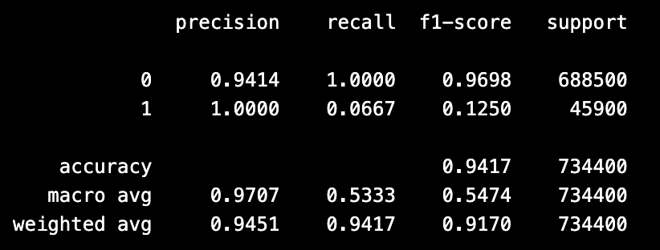

  

# Ichiban Runner – Who Is Number One Horse

## Introduction

In this project, we aim to build a classification model to predict horse racing outcomes using historical data from the Japan Jockey Association (JRA). Our primary goal is to determine whether a horse will finish in the top 1 position of a race and to evaluate different machine learning algorithms for predictive performance and interpretability.

## Problem Statement

We formulate this as a multiclass classification problem:

    Top 1: Horse wins the race

The broader goals include:

    Identifying the most predictive features of race outcomes.

    Evaluating and comparing multiple machine learning models.

    Recommending the best model based on a balance of accuracy and interpretability.

## Data Overview

    Source: Japan Jockey Association (JRA)

    Collection: Web-scraped historical data

    Granularity: Each row = one horse’s result in one race

## Features
* Since each model learns features differently, these models we try are input different features based on their feature importances.

## Feature Engineering

-Transformed Final Time from mm:ss.s to total seconds.

- Parsed Age/Sex into two features: numeric age and categorical sex.

- One-hot encoded Grade, Weather, and Race Type.

- Created binary target variables for Top 1 and Top 3 finishes.

- Normalized Odds and Horse Weight.

## Reproduction

## Modeling & Evaluation

We tested the following models:

    Logistic Regression (baseline)

    Decision Tree

    K-Nearest Neighbors

    Random Forest

    LightGBM

    Neural Network (PyTorch)

    RBF SVC

### Decision Tree Mode:

Optimal Parameters Identified

    Max Depth: None

    Minimum Samples Split: 2

    Criterion: Entropy

Performance Results

    Accuracy: 8.96%

    Precision (weighted): 8.58%

    Recall (weighted): 8.96%

    F1 Score (weighted): 8.69%

Interpretation of Results

The Decision Tree model performed poorly in predicting horse racing outcomes, indicated by very low accuracy and F1 scores. The model's results imply high unpredictability or complexity within the horse racing data that simple decision boundaries fail to capture effectively.

### KNN Model:

Optimal Parameters Identified

    Number of Neighbors (k): 7

    Weights: Distance-based

    Distance Metric (p): 2 (Euclidean distance)

Performance Results

    Accuracy: 8.49%

    Precision (weighted): 8.89%

    Recall (weighted): 8.49%

    F1 Score (weighted): 8.52%

Interpretation of Results

The KNN model's performance in predicting horse racing outcomes was limited, similar to the Decision Tree model. Low accuracy and F1 scores indicate difficulty capturing meaningful patterns or reliable distinctions among outcomes.

### Random Forest Model:

Optimal Parameters Identified

    Number of Estimators: 150

    Max Depth: None

    Minimum Samples Split: 2

    Class Weight: Balanced

Performance Results

    Accuracy: 7.08%

    Precision (weighted): 6.72%

    Recall (weighted): 7.08%

    F1 Score (weighted): 6.79%

Interpretation of Results

Despite generally being powerful, the Random Forest model showed very limited predictive capabilities in this specific horse racing context, indicated by extremely low performance metrics. This suggests substantial unpredictability in outcomes or inadequacy of features for effective prediction.

### LightGBMClassifier Model: 
* LightGBM (Light Gradient Boosting Machine) is a tree-based model which is usually used for classification when working with large dataset. Based on our goal, this LightGBM Classifier is combined with pairwise since it is a ranking problem to compare pairs of horses in the same race. Also, we calibrate the probabilities to adjust the predicted probabilities to fit the real situation better.
* Run `lightgbm_diff_pairwise.ipynb`: After finding feature importances from `top_features_lightgbm.ipynb`, the model is a feature-based LightGBMClassifier Model.
### LightGBM Ranker: 
* LightGBM Ranker is special version of LightGBM designed for learning-to-rank like horse ranking. The lightGBM Ranker can predict ranking order within group, istead of training horses individually. 
* Run `lightgbm_ranker.ipynb`: We can get Top-1 accuracy from LightGBM Ranker which is group-awarness.
## Metrics

Models were evaluated using:

    Accuracy

    ROC-AUC Score

    Average Precision

    Confusion Matrix

## Results
### Results for LightGBMClassifier Model:
#### Classification Report

#### AUC Score

### Results for LightGBM Ranker:
#### Top-1 Accuracy

## Limitations
* Different Features in Models: Since each model was trained using a different set of features, which may affect the fairness and consistency of model comparisons. Since the input features are not standardized across models, differences in performance may partially reflect differences in feature selection rather than model capability alone.
* Imbalanced Dataset: Since only one horse per race is labeled as a winner (1), while the other 15 are labeled as non-winners (0). This imbalance may affect the model’s ability to accurately predict the true winner.
## Conclusion/Recommendation

## Appendix
